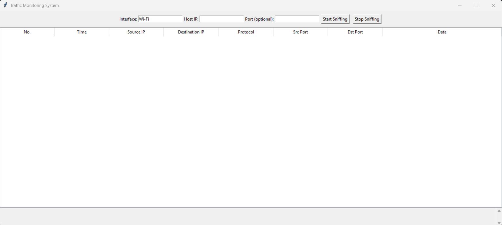
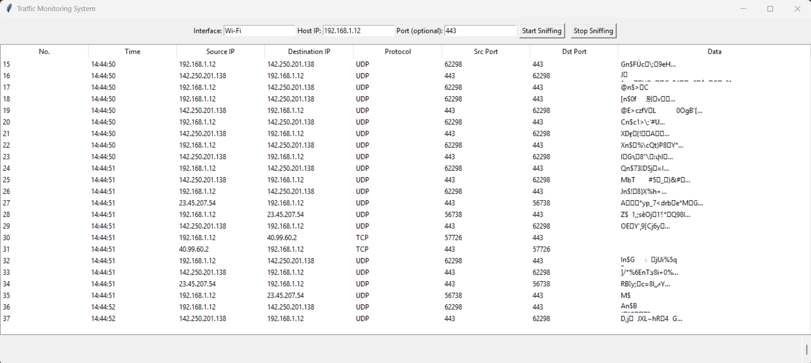

# 🧪 Python-Based Packet Sniffer with GUI (Wireshark-Like)

## 📋 Project Description

This project is a custom-built network packet sniffer developed in Python, designed to capture and analyze real-time incoming and outgoing traffic on a specified network interface. The sniffer provides a graphical user interface (GUI) similar to Wireshark, displaying live packet data in a structured table view. It supports filtering by IP address and port and includes features such as automatic scrolling and the ability to stop the capture session through a dedicated button.

The application uses the Scapy library for low-level packet inspection and Tkinter with ttk.Treeview for the GUI. This program was developed as a part of an assignment provided by CodeAlpha, which aimed to explore real-time network monitoring solutions using Python.

---

## 🚀 Features

- 📡 **Live Packet Capture**  
  Monitor traffic in real-time using Scapy.

- 🖥️ **Graphical User Interface (GUI)**  
  Built with `tkinter`, featuring a scrollable table of captured packets.

- 🎯 **Filter Options**  
  Capture packets based on a specific host IP address and optionally by port.

- 🧭 **Auto-Scrolling Output**  
  Automatically scrolls to show the latest captured packets in the view.

- 🛑 **Stop Button**  
  Gracefully stops the packet sniffing without closing the interface.

---

## 🛠️ Technologies Used

- Python 3.x  
- [Scapy](https://scapy.net/) — for packet sniffing  
- `tkinter` — for GUI development  
- `ttk.Treeview` — for table formatting in GUI  
- **Npcap** (Windows) — required for capturing packets

---

## 📦 Installation

1. Clone this repository:
   ```bash
   git clone https://github.com/Danyal-Raza/Network_Sniffer.git
   cd "Network_Sniffer/Traffic Monitoring System"

2. Install Dependencies:
   ```bash
   pip install scapy

3. Ensure Npcap is installed on your system (for Windows):
   https://npcap.com

## 🧑‍💻 Usage

1. Run the script:
   ```bash
   python traffic_monitor.py

2. Enter the host IP you want to monitor.
3. (Optional) Enter a port number or leave it blank to sniff all ports.
4. Click Stop to end the capture session when needed.

## 📚 Screenshots




## 👤 Author

Developed by Syed Danyal Raza
Assignment submitted to CodeAlpha

## 📃 License
This project is licensed under the MIT License.
